# Preparing for Deploy

## Overview
Prepare release code with six hard-gated stages. No stage may be skipped; green CI does not replace human audits for dead code, stale docs, or deploy curation.

## When to Use
- Asked to merge into `deploy`/release branch
- Asked to "ship now" or "build/publish image"
- Docs or tests are assumed correct without verification
- Need a repeatable deploy-readiness audit

```dot
digraph deploy_flow {
    "Deploy request received" [shape=doublecircle];
    "Stage 1: Mechanical Cleanup" [shape=box];
    "Gate 1 passed?" [shape=diamond];
    "Stage 2: Code Audit" [shape=box];
    "Gate 2 passed?" [shape=diamond];
    "Stage 3: Documentation Audit" [shape=box];
    "Gate 3 passed?" [shape=diamond];
    "Stage 4: Test Verification" [shape=box];
    "Gate 4 passed?" [shape=diamond];
    "Stage 5: Deploy Branch Curation" [shape=box];
    "Gate 5 passed?" [shape=diamond];
    "Stage 6: Merge, CI, Build" [shape=box];
    "Gate 6 passed?" [shape=diamond];
    "Deploy-ready image" [shape=doublecircle];

    "Deploy request received" -> "Stage 1: Mechanical Cleanup";
    "Stage 1: Mechanical Cleanup" -> "Gate 1 passed?";
    "Gate 1 passed?" -> "Stage 2: Code Audit" [label="yes"];
    "Gate 1 passed?" -> "Stage 1: Mechanical Cleanup" [label="no"];
    "Stage 2: Code Audit" -> "Gate 2 passed?";
    "Gate 2 passed?" -> "Stage 3: Documentation Audit" [label="yes"];
    "Gate 2 passed?" -> "Stage 2: Code Audit" [label="no"];
    "Stage 3: Documentation Audit" -> "Gate 3 passed?";
    "Gate 3 passed?" -> "Stage 4: Test Verification" [label="yes"];
    "Gate 3 passed?" -> "Stage 3: Documentation Audit" [label="no"];
    "Stage 4: Test Verification" -> "Gate 4 passed?";
    "Gate 4 passed?" -> "Stage 5: Deploy Branch Curation" [label="yes"];
    "Gate 4 passed?" -> "Stage 4: Test Verification" [label="no"];
    "Stage 5: Deploy Branch Curation" -> "Gate 5 passed?";
    "Gate 5 passed?" -> "Stage 6: Merge, CI, Build" [label="yes"];
    "Gate 5 passed?" -> "Stage 5: Deploy Branch Curation" [label="no"];
    "Stage 6: Merge, CI, Build" -> "Gate 6 passed?";
    "Gate 6 passed?" -> "Deploy-ready image" [label="yes"];
    "Gate 6 passed?" -> "Stage 6: Merge, CI, Build" [label="no"];
}
```

## Stages and Gates
1. Mechanical cleanup: formatter, lint fix, lockfile integrity. **Gate:** no lint/format drift.
2. Code audit: unused exports, dead branches, stale TODO/import refs, dependency hygiene. **Gate:** each finding fixed or accepted with rationale.
3. Documentation audit: verify every claim against code/runtime behavior. **Gate:** docs are true now, not historically true.
4. Test verification: full suite, no `.skip`/`.only`, changed areas covered. **Gate:** all tests green with no disabled tests.
5. Deploy curation: include only vetted release assets; run file-by-file vetting chain. **Gate:** every deploy file maps to a vetting stage.
6. Merge/CI/build: merge to deploy, run enforced checks, build/publish image, startup smoke check. **Gate:** image pull/run succeeds.

## Vetting Chain
| File category | Required vetting |
|---|---|
| Source (`app/`, `components/`, `lib/`, `types/`) | Stages 1, 2, 4 |
| Canonical docs (`docs/*.md`, `README.md`) | Stage 3 |
| Config (`package*.json`, `tsconfig*`, lint/build config) | Stages 1, 2 |
| Prisma schema/migrations | Stages 4, 6 |
| Docker + CI files | Stage 6 |
| Tests | Stage 4 |
| `.env.example` | Stages 3, 6 |

## Project Discovery
- Find formatter/linter/test/build commands from project config.
- Identify canonical docs and deploy branch policy.
- Define include/exclude sets before Stage 5.
- Map CI automation to machine-checkable gates; keep judgment checks in manual stages.

## Anti-Patterns
| Rationalization | Counter |
|---|---|
| "It is one line." | Small changes still run all gates. |
| "Docs are probably up to date." | Trust nothing; verify each claim. |
| "Tests are green, ship it." | Green tests do not prove no dead code/stale refs. |
| "Merge now, fix next deploy." | Deploy branch only accepts release-ready state. |

## Red Flags
- Skipping any stage due to urgency or scope
- Approving docs without code-level verification
- Leaving `.skip`/`.only` in tests
- Keeping files on deploy with no vetting-stage trace
- Accepting unresolved findings without written rationale
