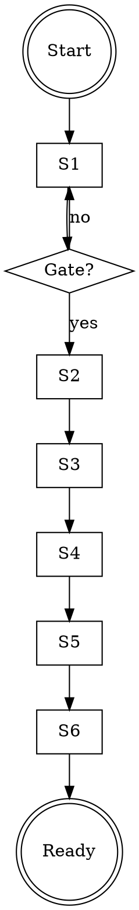

# Preparing for Deploy

## Overview
Run six hard-gated stages before release. No skips. Passing CI does not replace code/doc/deploy audits.

## When to Use
- Asked to merge into `deploy`/release branch
- Asked to "ship now" or "build/publish image"
- Need a repeatable deploy-readiness audit

## Stages and Gates
1. Cleanup: formatter/lint/lockfile. **Gate:** zero drift/errors.
2. Code audit: dead code, stale refs, dependency hygiene. **Gate:** each finding fixed or accepted with evidence.
3. Docs audit: verify each claim against current code. **Gate:** docs are true now.
4. Test verify: full suite, no `.skip`/`.only`, changed areas covered. **Gate:** all pass with no disabled tests.
5. Deploy curation: include only release files; enforce vetting chain. **Gate:** every deploy file traces to stages.
6. Merge/CI/build: protected merge, checks pass, image pull/run smoke passes. **Gate:** runnable image.

## Evidence Minimums (required)
- "Accepted with rationale" must include owner, issue, expiry, and deploy risk.
- Doc verification must be claim-by-claim; no "sampled docs" approval.
- Stage-4 results must come from the current commit (no "equivalent prior run" reuse).
- Vetting-chain mapping must reference concrete files, not category-only statements.

## Vetting Chain
| File category | Required vetting |
|---|---|
| Source | 1, 2, 4 |
| Canonical docs + README | 3 |
| Config + dependencies | 1, 2 |
| Prisma + Docker + CI | 4, 6 |
| Tests | 4 |
| `.env.example` | 3, 6 |

## Project Discovery
- Detect formatter/linter/test/build commands from repo config.
- Identify canonical docs and deploy include/exclude policy.

## Anti-Patterns
| Rationalization | Counter |
|---|---|
| "It is one line." | Small changes still run all gates. |
| "Docs are probably up to date." | Trust nothing; verify each claim. |
| "Tests are green, ship it." | Green tests do not prove release readiness. |
| "Merge now, fix next deploy." | Deploy branch only accepts release-ready state. |
| "Rationale exists, so done." | Rationale without owner/issue/expiry/risk is invalid. |
| "Equivalent prior run." | Stage 4 evidence must match current commit. |

## Red Flags
- Skipping any stage due to urgency or scope
- Approving docs without code-level verification
- Leaving `.skip`/`.only` in tests
- Keeping files on deploy with no vetting-stage trace
- Accepting unresolved findings without written rationale
- Proceeding to merge while any gate is failing (create remediation backlog instead)
