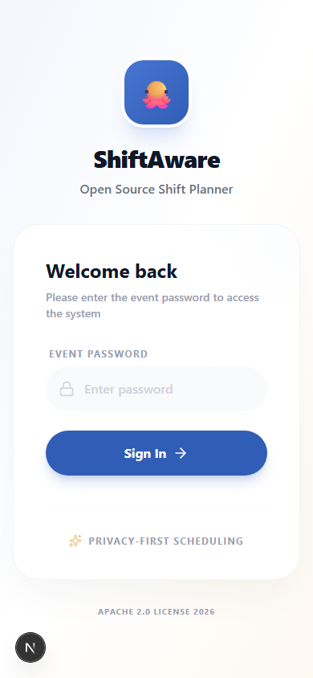
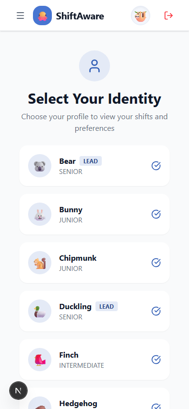
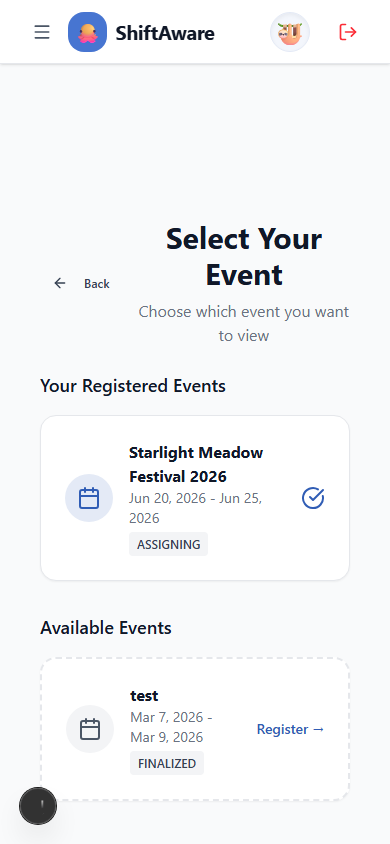
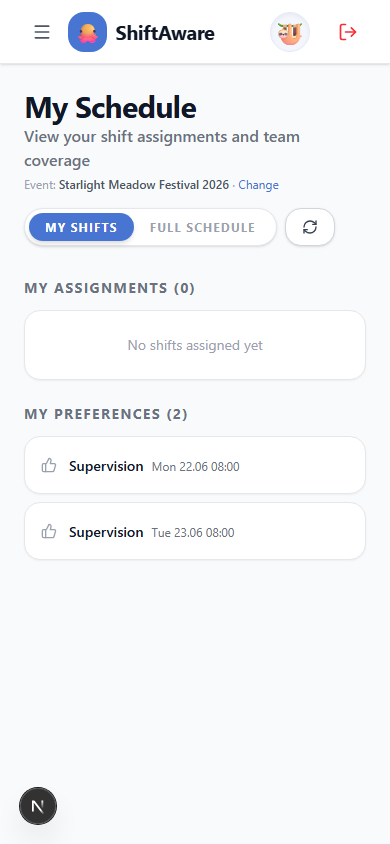
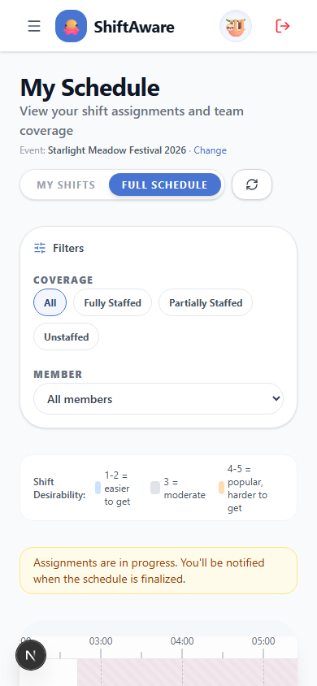
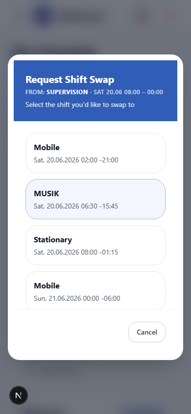

# ShiftAware — User Manual

> **Scope:** This manual is written for people who operate the ShiftAware UI — organizers (admins) and team members (volunteers). It is derived from the application as of 2026-03-28. If labels or steps differ from what you see, the UI is the authority; please open a documentation PR to sync this manual.
>
> For developer and deployment information see the root `README.md` and `docs/`.

---

## Table of Contents

1. [Introduction](#1-introduction)
2. [Concepts and lifecycle](#2-concepts-and-lifecycle)
3. [For organizers](#3-for-organizers)
4. [For volunteers](#4-for-volunteers)
5. [Troubleshooting](#5-troubleshooting)
6. [Further reading](#6-further-reading)

---

## 1. Introduction

ShiftAware helps small event teams plan and assign shifts fairly and privately. Organizers design the schedule and run an automated allocation; team members vote on which shifts they prefer without exposing their real names to the system.

This guide walks through every screen in plain language. You do not need to read any technical documentation to use the tool — this manual is enough. If you are curious about the system design or want to contribute code, see `docs/PROJECT-OVERVIEW.md` as a starting point.

---

## 2. Concepts and lifecycle

### Key terms

| Term | What it means in plain language |
| ---- | ------------------------------- |
| **Event** | One festival or event instance (e.g. "Summer Fest 2026"). All shifts, members, and assignments belong to a specific event. |
| **Shift template** | A reusable recipe for a type of shift — its name, color, and default capacity. Templates are created once and reused across events. |
| **Shift** | A concrete slot in the schedule: a specific start/end time on a specific day, tied to a template. |
| **Lane** | A vertical column on the schedule calendar, derived from the template name. Each template type gets its own lane. |
| **Preference** | A vote a team member casts on a shift: **Want** or **Don't want**. Visible to the organizer; used by the allocation engine. |
| **Assignment** | A team member confirmed for a specific shift, either by the algorithm or by manual organizer action. |
| **Event status** | The lifecycle stage of an event. It controls what actions are available at any given time (see table below). |

### Event lifecycle

Events move through five stages in order. Organizers advance (or revert) the status from the Shift Schedule page.

```
PLANNING → OPEN FOR PREFERENCES → ASSIGNING → FINALIZED → COMPLETED
```

| Stage | Who acts | What can happen |
| ----- | -------- | --------------- |
| **Planning** | Organizer | Create and edit shifts; register team members for the event |
| **Open for preferences** | Team members | Vote Want / Don't Want on each shift |
| **Assigning** | Organizer | Run the allocation algorithm; review and adjust results |
| **Finalized** | Organizer | Manual reassignments only (e.g. late drop-outs) |
| **Completed** | Nobody | Read-only archive; revert to Finalized if a late change is needed |

> Stages can be moved backward as well as forward. Use the status transition buttons on the Shift Schedule page.

---

## 3. For organizers

Organizers access the admin area via the left sidebar (desktop) or the slide-out menu (mobile). The sidebar contains four sections: **Event Setup**, **Shift Schedule**, **Team Management**, and **Audit Log**.

Before starting, select the event you are working on using the event selector in the top header (desktop) or the mobile menu.

---

### 3.1 Event Setup — `/admin/setup`

Use this page to configure the event, define shift templates, and set team attribute definitions. It has three tabs.

**Event Settings tab**

1. Set the event name, start date, and end date.
2. Set the event password that team members will use to log in.
3. Save your changes.

**Shift Templates tab**

Shift templates define the categories of work at your event (e.g. "Bar", "Gate", "Info Desk").

1. Click **Add template** to create a new template.
2. Enter a name, choose a color, set the default capacity (staff slots per shift), and optionally set a desirability score (1–5, where 5 is the most in-demand).
3. Assign the template to the current event so it appears as a lane on the schedule.
4. To edit or remove an existing template, use the controls next to each entry in the list.

**Team Attributes tab**

Attributes are extra properties you can collect from team members for this event (e.g. "Do you have a first-aid certificate?"). The algorithm can use these to enforce staffing constraints.

1. Click **Add attribute** and give it a name and type (text, boolean, etc.).
2. Members will be prompted to fill in any missing attributes when they select this event on the identity page.

---

### 3.2 Shift Schedule — `/admin/shifts/schedule`

This is the main scheduling workspace. It shows all shifts for the selected event and lets you advance the event status.

**List view vs. Calendar view**

- **List view** (default): all shifts in a card list. Good for an overview and for creating individual shifts with a form.
- **Calendar view**: a lane-based timeline canvas. Good for visualising the full schedule and dragging shifts into place.

Switch between views using the list / calendar icons in the top-right toolbar.

**Creating shifts (Planning stage only)**

1. In list view, click **Define New Shift** to open the creation form in the sidebar.
2. Select a template (required when templates are assigned to the event).
3. Set the start date/time. The end time is calculated automatically from the template's default duration; adjust it if needed.
4. Set **Staff Capacity** and **Score (1–5)**, then click **Register Shift**.

In calendar view you can also drag a template card from the **Template Palette** (the row of colored cards above the canvas) onto the timeline to create a shift at that position.

> Shifts can only be created or deleted while the event is in the **Planning** stage. Once you publish shifts (move to "Open for preferences") the form is hidden and delete buttons are disabled.

**Editing a shift**

Click the arrow icon on a list-view card, or click a shift block on the calendar canvas, to open the **Shift Properties** panel on the right. You can edit time, capacity, assignments, and required roles from there.

**Advancing the event status**

The current status badge and action button appear at the top-right of the page. The button label changes at each stage:

| Current status | Button label |
| -------------- | ------------ |
| Planning | **Publish Shifts** → moves to Open for preferences |
| Open for preferences | **Close Preferences** → moves to Assigning |
| Assigning | **Finalize Schedule** → moves to Finalized |
| Finalized | **Mark Complete** → moves to Completed |

A **Back to …** link lets you revert one stage when corrections are needed.

**Running allocation (Assigning stage)**

When the event is in the Assigning stage:

1. Open the Shift Properties panel for any shift and click **Run Allocation**, or use the allocation controls in the Team Management page.
2. The algorithm reads member preferences and team attributes to propose assignments.
3. An **Algorithm Results** preview appears. Review the proposed assignments.
4. Accept the results or make manual adjustments by dragging members between shifts in the Shift Properties panel.
5. When satisfied, click **Finalize Schedule** to lock in the assignments.

**Exporting the schedule (calendar view)**

In calendar view, click **Export** and choose **Export as PNG** (a snapshot image) or **Export as PDF Table** (a printable day-by-day table).

---

### 3.3 Team Management — `/admin/team`

This page has two tabs: **Team Members** and **Allocation & Distribution**.

**Team Members tab**

Shows all members registered for the selected event. Click a member avatar to open their **Profile Detail** card, which shows experience level, capabilities, and attributes. From the profile card you can edit details directly.

> Team members register themselves via the identity page. You do not need to create profiles for them — they self-onboard using their chosen alias and avatar.

**Allocation & Distribution tab**

Configure constraints for the allocation algorithm:

- Set minimum and maximum shifts per member.
- Set per-role quotas if required.
- These settings take effect when you run allocation from the Shift Schedule page.

---

### 3.4 Team Members — `/admin/team/manage`

A deeper member management view, separate from the event-scoped Team Management page.

**List view**

All team members across all events are shown here. Each card displays the member's alias and avatar. Use the search box to filter by alias.

- Click the avatar to open the **Profile Detail** card (read the profile, edit capabilities and experience level).
- Click the deactivate icon (user-X) to mark a member inactive. Their preferences and assignments are preserved; they are hidden from active member lists. The action can be reversed.
- Inactive members show a red "Inactive" badge and a reactivate button (user-check).

**Heatmap view**

Switch to **Heatmap** to see a matrix of all members versus all shifts with preference votes. Useful for spotting coverage gaps before running allocation.

**Exporting the pseudonym mapping**

Click **Export Mapping** to download a PDF table with columns for avatar, alias, and a blank "Real Name" column. Fill this in locally to maintain a private record of who each alias belongs to. Keep the file off the system.

---

### 3.5 Audit Log — `/admin/audit`

Every create, update, delete, and assignment action is logged here with a timestamp, the acting member's alias, and a before/after diff.

**Filtering**

Use the filters at the top to narrow by:
- **Action** (Create, Update, Delete, Manual Swap, Assignment Run, etc.)
- **Entity type** (Shift, Team Member, Assignment, Preference)
- **Date range**
- Free-text **Search**

**Rollback**

Most logged actions have a **Rollback** button that undoes the change. Rollback entries themselves are logged and cannot be rolled back again.

**Exporting**

Click **Export CSV** to download the current filtered view as a spreadsheet.

---

## 4. For volunteers

Team members access ShiftAware via a web browser. No account creation is required — you log in with the shared event password and choose your alias.

---

### 4.1 Logging in — `/login`

1. Open the ShiftAware URL provided by your organizer.
2. Enter the **Event Password** (shared by the organizer out of band).
3. Click **Sign In**. If the password is wrong you will see "Access Denied". After several failed attempts you must wait before trying again.


*Login screen — enter the event password shared by your organizer.*

---

### 4.2 Selecting your identity — `/app/identity`

After logging in you land on the **Select Your Identity** screen.


*Identity selection — choose your alias from the list.*

1. Find your alias (avatar + name) in the list and click it.
   - If this is your first time: click **Create New Profile**, enter an alias and choose an avatar emoji, then submit. Your organizer can link your alias to your real name using the pseudonym mapping export.
2. After selecting your alias, choose the **event** you are participating in.


*Event selection — pick the event you are attending.*

3. If the event has required attributes (e.g. first-aid certificate), a prompt appears. Fill in the fields and submit.
4. You are redirected to the **My Schedule** page.

> Your identity choice is stored in the browser for the session. If you switch devices or clear the browser, you will need to select your identity again.

---

### 4.3 Viewing your schedule and voting preferences — `/app/calendar`

The **My Schedule** page has two views: **My Shifts** and **Full Schedule**.

**My Shifts view** (default)

Shows only the shifts you are assigned to. Each card lists the shift name, date, time, and your fellow team members on that shift.


*My Shifts — your personal assignment list.*

- If preferences are open (event status is "Open for preferences"), a **Want / Don't Want** toggle appears on each shift card so you can vote.
- If the schedule is finalized, the cards are read-only.
- Click **Request Swap** on any of your assigned shifts to open the swap request modal (see below).

**Full Schedule view**

Shows the complete event schedule as a lane calendar. All shifts are visible across all lanes (shift types).


*Full Schedule — the complete lane calendar for the event.*

- When preferences are open, click any shift block to open the **Preference panel** on the right and vote Want or Don't Want.
- Use the **Coverage** and **Member** filters above the calendar to focus on specific staffing states or colleagues.
- The desirability legend at the top explains the color tinting: blue tint = lower score (easier to get), orange tint = higher score (popular, harder to get).

**Requesting a shift swap**

1. In the My Shifts view, click **Request Swap** on the shift you want to trade.
2. A modal lists all other shifts in the event that you are not already assigned to.
3. Select the shift you would like to swap to and confirm.
4. The organizer reviews swap requests and approves or rejects them from the admin area.


*Swap request modal — select the shift you want to swap to.*

---

## 5. Troubleshooting

**I cannot see any shifts on the calendar.**

The event may still be in the Planning stage. Shifts are only visible to team members after the organizer publishes them (moves the event to "Open for preferences"). Ask your organizer to confirm the event status.

**The preference voting buttons are not showing.**

Preferences can only be submitted while the event is in the "Open for preferences" stage. If you do not see Want / Don't Want buttons, the organizer has either not yet opened preferences or has already closed them. Contact your organizer.

**My shifts list is empty even though the schedule is finalized.**

1. Make sure you selected the correct identity and the correct event on the identity page.
2. If you recently switched browsers or devices, your identity selection was lost. Go to `/app/identity` and reselect your alias and event.
3. Ask your organizer to confirm that your alias is registered for the event and that assignments have been run.

**I see "No event selected" on the calendar page.**

You reached the calendar without selecting an event. Go back to `/app/identity` and complete the event selection step.

**I created a profile but my alias does not appear in the list.**

Profile creation may have failed silently. Refresh the identity page. If the alias still does not appear, try creating it again with a slightly different alias (duplicates are not allowed). Report the issue to your organizer.

**The organizer says lanes are missing on the schedule.**

Each lane corresponds to a shift template assigned to the event. If a template has not been assigned to the event in Event Setup → Shift Templates, its shifts will not appear on the calendar. The organizer should go to Event Setup and assign the missing template to the event.

**The algorithm produced empty or very few assignments.**

Two common causes: (1) not all team members have been registered for the event — the organizer should check Team Management; (2) the event is not in the Assigning stage — allocation requires that status. Check both before re-running.

**A shift shows as "Fully Staffed" but I see empty slots.**

The capacity field may have been set incorrectly. The organizer can update the shift's capacity from the Shift Properties panel in the calendar view (Planning or Finalized stage).

**I submitted a preference but it does not appear.**

Preferences are saved immediately on click. Refresh the page. If it still does not appear, the event may have moved out of "Open for preferences" before your click was processed. Contact your organizer.

**The swap request modal says "No available shifts to swap to".**

All other shifts either already have you assigned, or no shifts exist in the event yet. Contact your organizer if you believe this is wrong.

---

## 6. Further reading

- **This manual** — the document you are reading.
- **Project overview (for developers):** `docs/PROJECT-OVERVIEW.md`
- **Questions or corrections:** open a documentation PR or contact your team organizer.
